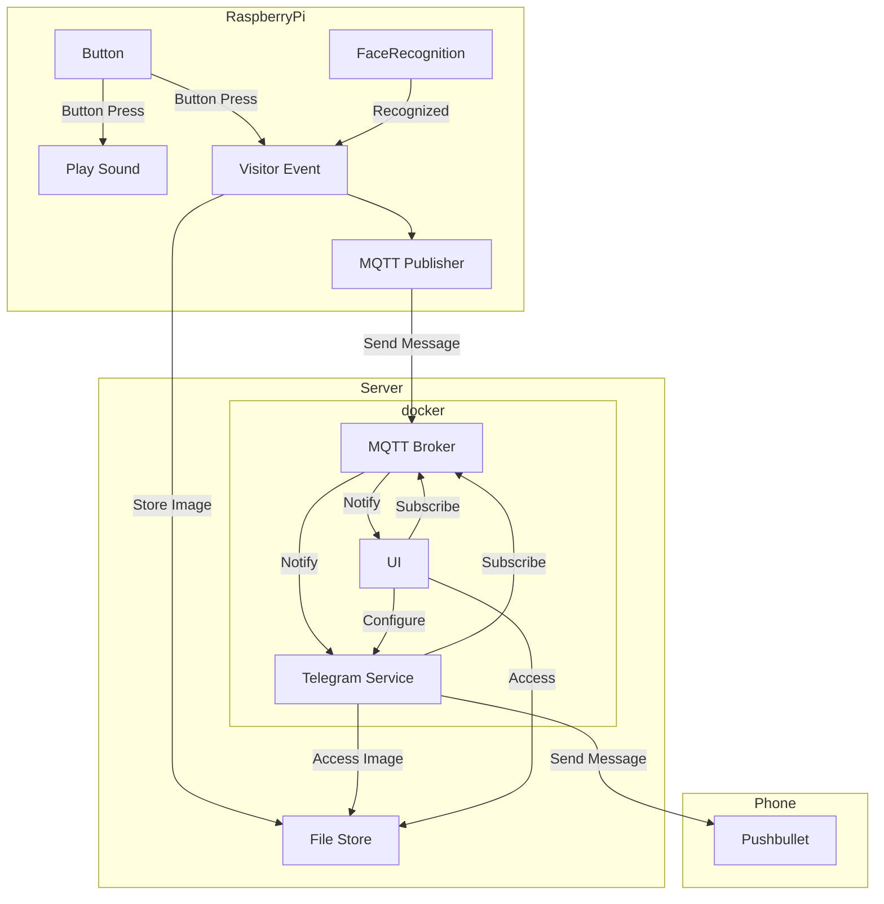
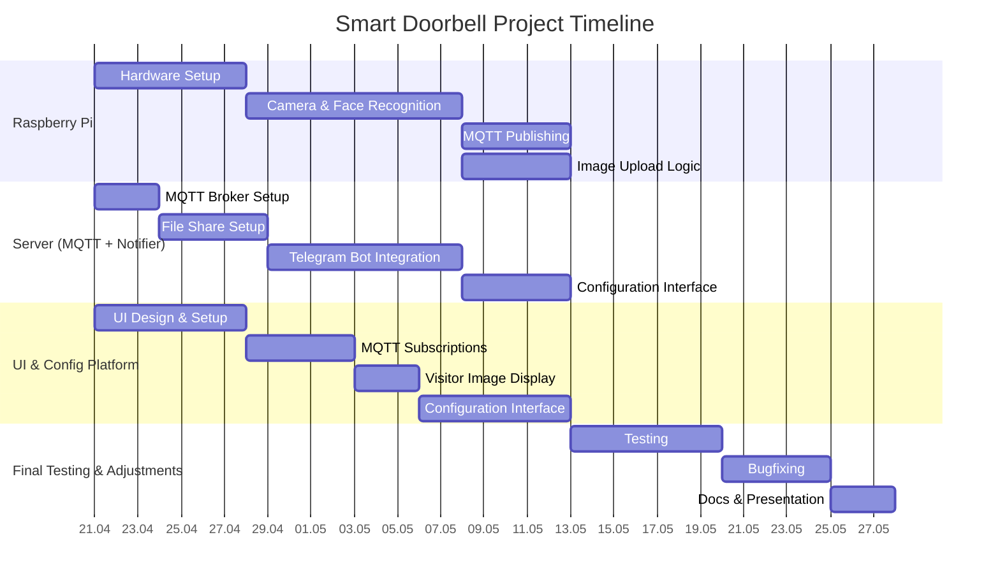

# Raspberry Pi - Telegram Doorbell

## System Architecture

## Responsibilities

| Task/Component                        | Ziyan Wang        | Assel Massaurova  | Florian Schwarzmayr |
| :------------------------------------ | ----------------- | ----------------- | ------------------- |
| **Sensor \+ Actuator Combo**          | Camera \+ Speaker | Button \+ Speaker | Trigger \+ MQTT/FS  |
| Face Detection Logic                  | ✅                |                   |                     |
| GPIO Button Logic                     |                   | ✅                |                     |
| Sound Playback (shared logic)         | ✅                | ✅                |                     |
| Snapshot Capture                      | ✅                |                   |                     |
| Image Upload to Shared FS             |                   |                   | ✅ done             |
| MQTT Publisher                        |                   |                   | ✅ done             |
| MQTT Broker Setup (Docker)            |                   |                   | ✅ done             |
| Pushbullet Notification (Upload & Notify)    | ✅                  | ✅                | ✅ done             |
| Web UI – Image & History Display      | ✅                |                   |                     |
| Web UI – MQTT Subscription            |                   | ✅                |                     |
| Web UI – Config Panel                 |                   |                   | ✅ done             |
| Notification Preferences & Thresholds |                   |                   | ✅ done             |
| System Testing                        | ✅                | ✅                | ✅                  |
| Bugfixing                             | ✅                | ✅                | ✅                  |
| Documentation & Presentation          | ✅                | ✅                |                     |

## Schedule

